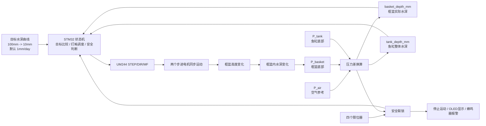
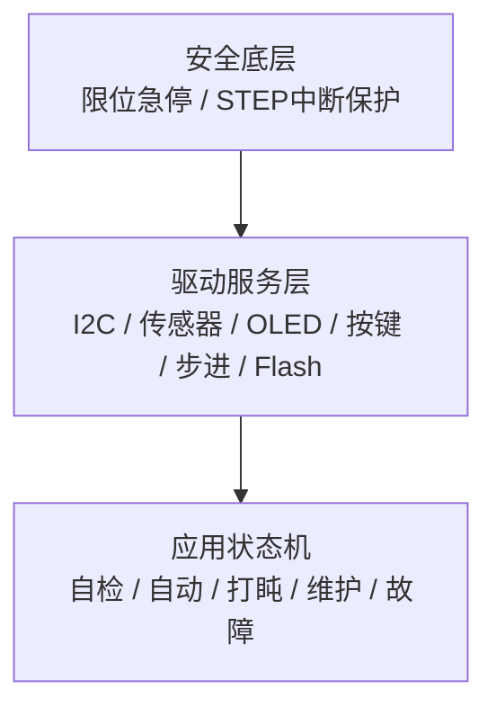

# 鱼缸框篮自动升降控制项目汇报提纲

## 1. 项目目标

本项目设计一个基于 STM32F103C8T6 的鱼缸框篮自动升降装置。

核心目标：

- 控制对象是框篮内实际可活动水深，不是整体鱼缸水位。
- 让多鳍鱼幼鱼从深水位逐步适应浅水位。
- 默认从 `100mm` 逐步过渡到 `10mm`。
- 默认每日变浅 `1mm/day`，控制误差目标为 `±1mm`。

## 2. 系统总体方案

系统由传感、控制、执行、安全和人机交互五部分组成。

- 传感：三颗 WF5805F 压力传感器。
- 控制：STM32F103C8T6 最小系统板。
- 执行：UM244 驱动器同步驱动两个贯穿式步进电机。
- 安全：四个 24V NPN 限位器、蜂鸣器报警、故障状态机。
- 交互：OLED 显示和按键设置/维护。

## 3. 闭环控制结构



讲解重点：

- 传感器测量实际水深。
- 控制器比较实际水深和目标水深。
- 步进电机改变框篮高度。
- 框篮高度变化反过来改变水深，形成闭环。
- 限位器和异常检测独立进入安全联锁。

## 4. 水深测量方案

WF5805F 是绝对压力传感器，读数包含大气压，所以增加空气参考传感器。

三颗传感器分工：

| 传感器     | 位置           | 作用                     |
| ---------- | -------------- | ------------------------ |
| `P_air`    | 控制盒内空气中 | 去除大气压影响           |
| `P_tank`   | 鱼缸底部       | 判断整体鱼缸水深是否安全 |
| `P_basket` | 框篮底部       | 计算鱼实际可活动水深     |

计算逻辑：

```text
basket_depth = P_basket - P_air
tank_depth   = P_tank   - P_air
```

## 5. 执行机构设计

执行机构采用一个 UM244 驱动器同步控制两个贯穿式丝杆步进电机。

关键参数：

- 丝杆导程：`2mm/rev`
- 驱动细分：`1600 pulse/rev`
- 位移换算：`800 pulse/mm`
- 单次打盹：默认 `8 pulse = 0.01mm`
- 最大行程：`100mm`

电机不连续极慢速运行，而是采用“打盹模式”。

## 6. 打盹式运动策略

设计原因：

- 幼鱼体型小，水深变化必须非常缓慢。
- 长时间极低速连续转动不稳定，也容易产生控制误差。
- 微小脉冲分散到一天中执行，更适合 `1mm/day` 的慢变化目标。

策略：

- 每隔约 `14.4min` 唤醒一次。
- 每次输出 `8 pulse`，约移动 `0.01mm`。
- 脉冲频率默认 `800Hz`，一次动作约 `10ms`。
- 动作完成立即停止 STEP，不释放电机。

## 7. 安全设计

安全设计优先级高于自动控制。

必须停机的情况：

- 上升方向触发任意上限位。
- 下降方向触发任意下限位。
- 左右同方向限位状态不一致。
- 任一压力传感器连续读取失败。
- I2C 总线恢复失败。
- 鱼缸水位过低/过高。
- 框篮水深低于安全范围。
- 水位突变或卡滞趋势异常。

报警方式：

- OLED 显示错误原因。
- 蜂鸣器报警。
- 蜂鸣器可静音，但故障状态不清除。

## 8. 固件架构

固件采用三层分离和非阻塞设计。



关键原则：

- 不使用 `Delay` 做业务等待。
- 打盹间隔用时间戳调度。
- STEP 脉冲用定时器输出。
- 限位保护在 STEP 中断中直接检查。
- I2C 必须有超时和总线恢复。

## 9. 断电恢复策略

当前版本不增加 RTC 和 UPS。

恢复原则：

- 断电期间不补偿错过的位移。
- 重启后读取当前水深和 Flash 参数。
- 若自检通过、传感器正常、限位正常、位置可信，则继续按设定速度运行。
- 若水深差异异常或参数无效，则进入暂停报警，等待人工确认。

## 10. 项目亮点与风险

项目亮点：

- 控制框篮水深，而不是控制整个鱼缸水位。
- 使用三压力传感器消除大气压影响。
- 打盹式微位移适合幼鱼缓慢适应。
- 限位、传感器、I2C、状态机多层安全保护。
- 断电后可恢复控制，不追赶断电期间进度。

主要风险：

- WF5805F 防水封装会直接影响测量准确性。
- 水下 I2C 线缆容易受电机噪声影响。
- 两个电机并联一个驱动器，同步性需要实测验证。
- 无独立电流检测，卡滞只能通过水深趋势间接判断。

## 11. 建议汇报顺序

1. 先说明为什么要控制框篮水深。
2. 再说明传感器如何测出真实水深。
3. 然后讲步进电机如何改变框篮高度。
4. 用闭环图说明“测量、判断、执行、反馈”。
5. 最后强调安全保护、断电恢复和当前风险。


## 12. 核心的控制闭环：
                ┌────────────────────────────┐
                │        鱼缸 / 框篮系统       │
                │  框篮高度变化 → 框篮内水深变化 │
                └────────────┬───────────────┘
                             │
                             │ 水压变化
                             ▼
        ┌────────────────────────────────────────────┐
        │               三颗压力传感器               │
        │ P_air：空气参考                             │
        │ P_tank：鱼缸底部水深                        │
        │ P_basket：框篮底部实际水深                  │
        └────────────┬────────────┬─────────────────┘
                     │            │
                     │ I2C        │ I2C
                     ▼            ▼
               ┌────────────────────────┐
               │   STM32F103C8T6 主控   │
               │ 计算：                  │
               │ basket_depth = P_basket - P_air │
               │ tank_depth   = P_tank   - P_air │
               │                                  │
               │ 根据目标水深 / 每日变浅量 / 限位 │
               │ 决定是否输出 STEP / DIR / MF     │
               └────────────┬────────────────────┘
                            │
                            │ STEP / DIR / MF
                            ▼
                ┌────────────────────────────┐
                │  单路光耦隔离模块 ×3       │
                │  STEP→PU-                  │
                │  DIR →DR-                  │
                │  MF  →MF-                  │
                └────────────┬───────────────┘
                             │
                             │ 共阳控制信号
                             ▼
                   ┌────────────────────┐
                   │     UM244 驱动器    │
                   │ 24V供电，5V信号输入 │
                   └──────────┬─────────┘
                              │
                              │ A+/A-/B+/B-
                              ▼
              ┌──────────────────────────────────┐
              │ 两个并联贯穿式步进电机 + 丝杆机构 │
              │ 电机转动 → 丝杆移动 → 框篮升降     │
              └──────────────────┬───────────────┘
                                 │
                                 │ 框篮位置改变
                                 ▼
                      框篮内实际可活动水深改变
                                 │
                                 └────→ 再次被 P_basket 检测

